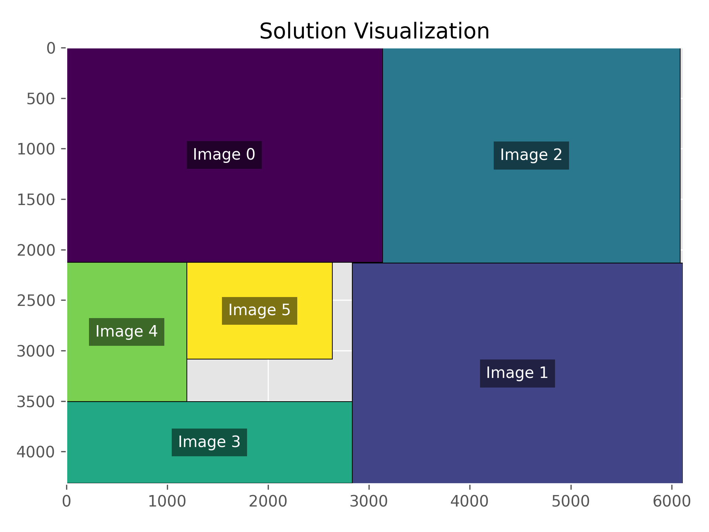

## Optimizing Image Placement on a Canvas: A Dive into Rectangle Packing
Have you ever tried to efficiently arrange a collection of images on a canvas, attempting to minimize wasted space? It might seem like a simple challenge, but beneath the surface, it's a classic computational problem that's surprisingly intricate. I recently embarked on a journey to find an optimal arrangement for a set of images, and along the way, I learned about the deep history and complexity of this fascinating problem.


## Structure of the Solution: A Creative Twist on Two-Stage Optimization
When faced with the challenge of minimizing unused space while arranging images on a canvas, we might be tempted to think it's a straightforward problem. However, the solution I've developed adds a dash of ingenuity to this seemingly simple puzzle. It's a testament to how a creative approach can transform a complex problem into an engaging and solvable challenge.

### Finding the Optimal Canvas Size: Not Just Any Binary Search
The first stage of this journey uses a binary search method, but not in the way you might expect. This isn't your run-of-the-mill binary search; it's a clever adaptation that seeks the most 'square-like' canvas size. Why square-like? Because it often leads to the most aesthetically pleasing and space-efficient arrangements.

And here's where it gets interesting: if we hit a roadblock and can't fit all the pictures, we don't just give up. Instead, we take a step back, remove the largest picture, and try again. This iterative process, much like an artist trying different compositions, ensures we find a canvas size that's just right.
### Optimal Placement of Images on the Canvas: Constraint Programming with a Twist
The second stage is where constraint programming shines. But it's not just about avoiding overlaps; it's about doing so in a way that's both efficient and visually appealing. We're not merely cramming images onto a canvas; we're orchestrating their placement with precision.

What's more, we introduce the option of scaling images. This is not just scaling for the sake of it, but a strategic move to make the best use of available space. It’s akin to finding the perfect puzzle piece – sometimes a slight adjustment can make all the difference.


## Tools Used: OR-Tools and its Solver
OR-Tools is Google's open-source software suite for optimization, which is utilized to solve the given constraint optimization problem.

`cp_model.CpModel()` creates an instance of the constraint programming model.
`cp_model.CpSolver()` is used to solve the defined model.


## Constraints and Objective Functions
### Constraints:
Image Boundaries: Ensure that images do not go outside the canvas boundary.
Non-overlapping: Images should not overlap each other.
Scaling: If scaling is allowed, images can be resized within a specified range.


### Objective Functions:
Unused Space: Minimize the unused space on the canvas.
Max Dimension: Minimize the maximum dimension of the bounding box containing all images.
Perimeter: Minimize the sum of the width and height of the bounding box containing all images.
Difference in Width and Height: Minimize the absolute difference between the width and height of the bounding box containing all images.

## Binary Search for Dimensions

In this approach, the size of the bounding box (or canvas) isn't decreased in fixed steps. Instead, a binary search technique is employed. This involves defining a range for the canvas dimensions and trying the midpoint size of this range. Depending on whether a solution is found with this size or not, the range of canvas dimensions is adjusted. This method is more efficient than simply reducing the size in fixed steps, as it can converge to the optimal size more quickly.


## Dynamic Adjustment of Alpha Range

Instead of using a fixed range for the alpha values (scaling factors for images), the range is dynamically adjusted based on the current bounding box size. The idea is to allow smaller scaling for larger bounding boxes and larger scaling for smaller bounding boxes.


## Initial Arrangement

Instead of starting with a random arrangement of images, a heuristic is used to determine an initial arrangement. This method sorts the images by their area in descending order, with the idea being that placing the largest images first might help the solver find a better solution more quickly.


## Parallel Solving

OR-Tools provides capabilities to solve problems in parallel. This means that if you have a multi-core machine, you can use these capabilities to potentially find solutions faster by leveraging multiple CPU cores simultaneously.


## Results

The following image showcases the solution of the optimization problem. It represents the optimal placement of images on the canvas, achieved through the described methodologies. This visualization helps in understanding how the images are arranged to minimize unused space, adhering to the constraints and objective functions defined in the model.




## Installation and Setup
### Prerequisites
- Python 3.10 or higher
- PDM (Python Dependency Manager)

### Installing PDM
If you don't have PDM installed, run:

```bash
python3 -m pip install --user pdm

git clone https://github.com/abbas-tari/2d-packing-optimization.git

cd 2d-packing-optimization

pdm install
pdm run python main.py
```